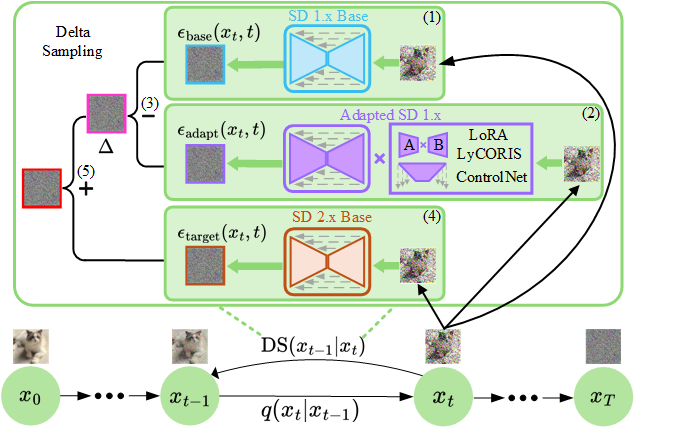
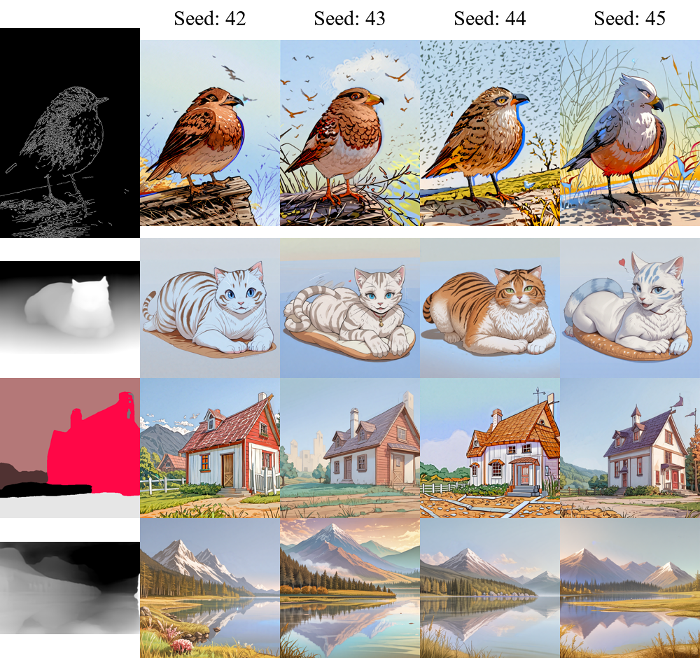
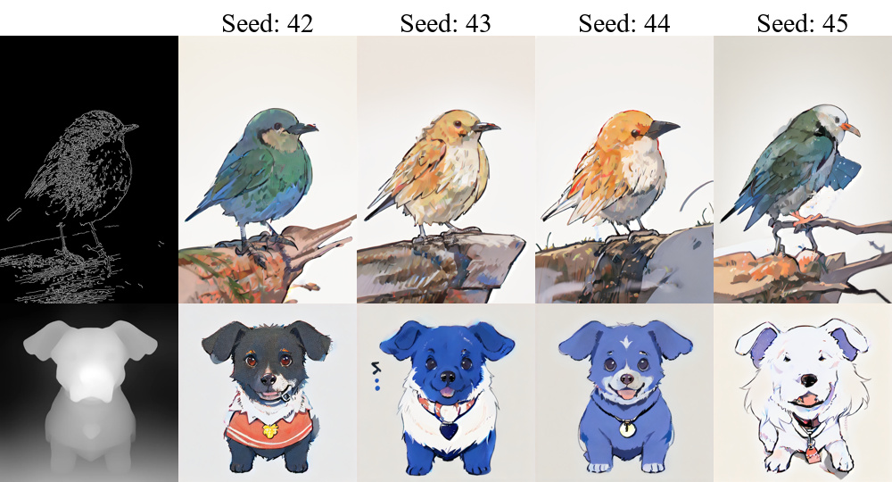
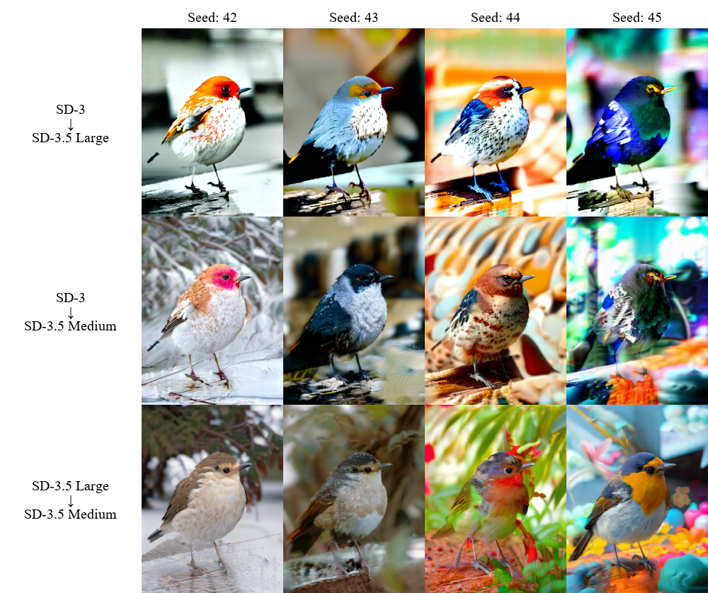
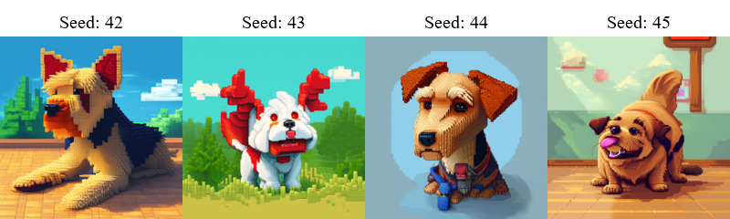
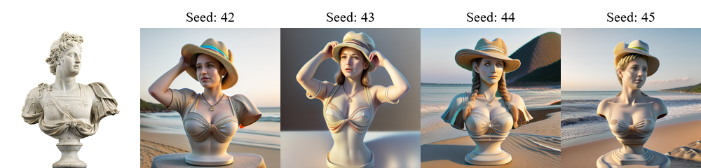

# Delta Sampling: Data-Free Knowledge Transfer Across Diffusion Models

Official implementation for our paper:

> **Delta Sampling: Data-Free Knowledge Transfer Across Diffusion Models**  
> [[Paper]](https://arxiv.org/abs/2512.03056)

---

## 🧠 Overview

**Delta Sampling (DS)** is a novel method for **inference-time knowledge transfer across diffusion models** — no retraining, no data access, and no architecture matching required. It works by computing the *delta* between a base diffusion model and its adapted variant (e.g., fine-tuned, LoRA, ControlNet), then injecting this delta into the denoising process of a different target model.

<p align="center">
  
</p>

---

## 📦 Repository Structure

```bash
.
├── delta_sampler.py         # Core implementation of Delta Sampling
├── template/                # ComfyUI workflow templates for experiments
├── README.md                # You are here
```

---

## 🔧 Installation & Setup

### 1. Install [ComfyUI](https://github.com/comfyanonymous/ComfyUI)

We recommend using a Python 3.10+ environment with CUDA-compatible GPU. Clone and set up ComfyUI:

```bash
git clone https://github.com/comfyanonymous/ComfyUI
cd ComfyUI
pip install -r requirements.txt
```

### 2. Install Delta Sampler

Place our file inside the `custom_nodes` folder:

```bash
cp delta_sampler.py path_to/ComfyUI/custom_nodes/
```

### 3. Download Models

You will need:

- **Base models**: e.g., `stable-diffusion-v1-5`, `stable-diffusion-2-1`
- **LoRA / LyCORIS modules**
- **Full fine-tuned checkpoints**
- **ControlNet** models (optional)

We used models from [CIVITAI](https://civitai.com/) and HuggingFace.

### 4. Launch ComfyUI

```bash
python main.py
```

Then, load the provided workflow from the `template/` directory via the ComfyUI browser interface.

---

## 🚀 Examples

Here are a few example configurations that reproduce results from our paper:

<!-- ### 🔄 Cross-Version Style Transfer -->

**Models used in the paper:**

- Base/Target model: [SD-1.5](https://huggingface.co/stable-diffusion-v1-5/stable-diffusion-v1-5), [SD-2.1](https://huggingface.co/stabilityai/stable-diffusion-2-1), [SD-XL](https://huggingface.co/stabilityai/stable-diffusion-2-1), [SD-3](https://huggingface.co/stabilityai/stable-diffusion-2-1), [SD-3.5 Medium](https://huggingface.co/stabilityai/stable-diffusion-2-1), [SD-3.5 Large](https://huggingface.co/stabilityai/stable-diffusion-2-1)
- Adapted model: [Photon_v1.safetensors](https://civitai.com/models/84728/photon), [revAnimated_v2.safetensors](https://civitai.com/models/7371/rev-animated), [LineArt.safetensors](https://www.liblib.art/modelinfo/d59a0d819d2c436f9efb5f0e4f9a0c0d)

- LoRA: [MoXinV1.safetensors](https://civitai.com/models/12597/moxin), [xrs2.0.safetensors](https://civitai.com/models/18323/xiaorenshu), [animeoutlineV4_16.safetensors](https://civitai.com/models/16014/anime-lineart-manga-like-style)
- ControlNet: `pose`, `depth`, `canny edge`, `normal`, `human pose`, and `segmentation`

You can download the ControlNet from [here](https://huggingface.co/lllyasviel/ControlNet-v1-1)

After download, move the checkpoints to `ComfyUI/models/checkpoints`, LoRA/LyCORIS to `ComfyUI/models/loras`, ControlNet to `ComfyUI/models/controlnet`

<!-- **Set the generation configuration as follow:**
- Delta guidance strength: `1.0`
- Seed: `42`
- Sampler: `euler`
- CFG: `5`
- Steps: `16`
- Scheduler: `normal`
- Resolution: `512 x 512` or `512 x 768` -->

### 🔄 SD-1.5 to SD-2.1

To reproduce the **Fig.2** in the paper, you can directly import the workflow from template folder: [LatentDeltaSampler.json](template/LatentDeltaSampler.json).

### 🔄 Combined Transfer: Full Fine-Tune Checkpoint, LoRA, and ControlNet

To reproduce the **Fig.3** in the paper, you can directly import the workflow from template folder: [LatentDeltaSamplerLoRACNet.json](template/LatentDeltaSamplerLoRACNet.json).

### 🔄 SD-1.5 to SD-XL

Compared to LoRA/LyCORIS fine-tuning, which usually influences image style and color, ControlNet provides a more distinguishable way to control the shape and style of generated images. Therefore, we primarily use ControlNet to evaluate the transferability of our method across larger models. Here we show the transfer effect between SD-1.5 and SDXL. To reproduce these images, you can directly import the workflow from template folder: [template/sd15-sdxl](template/sd15-sdxl).



### 🔄 SD-XL to SD-1.5

Here we show the inverse transfer effect from SD-XL to SD-1.5, you can directly import the workflow from template folder: [LatentDeltaSamplerCNet-SDXL-SD15.json](template/LatentDeltaSamplerCNet-SDXL-SD15.json). Here is the transfer result:




### 🔄 SD-3 to SD-3.5

DS is capable of working across a wide range of models. To demonstrate this capability, we start with the [canny bird image](cnet_images/images_bird_canny.png) to evaluate how well the concept transfers across different models. Here we show the transfer effect between SD-3, SD-3.5 Medium, and SD-3.5 Large, you can directly import the workflow from template folder: [LatentDeltaSamplerCNet-SD3-SD3.5M](template/LatentDeltaSamplerCNet-SD3-SD3.5M.json) and [LatentDeltaSamplerCNetSD35L-SD3.5M.json](template/LatentDeltaSamplerCNetSD35L-SD3.5M.json). Here is the transfer result:



### 🔄 Prompt Tuning (SD-3.5 Medium to SD-3.5 Large)

DS can also be used to transfer the style of prompt tuning. To demonstrate this capability, we use a LoRA model fine-tuned on SD 3.5 Medium (in a pixel art style) and transfer it to SD 3.5 Large. We apply different prompts to the SD 3.5 Medium model before and after adding the LoRA module (the original model lacks the pixel style, while the model with LoRA has it) to compute the delta. Note that the prompt for the SD 3.5 Large model does not contain any pixel-style keywords. You can directly import the workflow from template folder: [LoRA_SD3.5_M_L_Prompt_Tuning.json](template/LoRA_SD3.5_M_L_Prompt_Tuning.json). Here is the transfer result:




### 🔄 IP-Adapter

DS can also be used to transfer the effect of IP-Adapter. To demonstrate this capability, we adopt a classic demo from official repo of  [IP-Adapter](https://github.com/tencent-ailab/IP-Adapter). The left figure is the target concept. 
You can directly import the workflow from template folder: [LatentDeltaSamplerIPAdapter.json](template/LatentDeltaSamplerIPAdapter.json).



<!-- ### 🎨 Multi-Module Adaptation Transfer

**Use a combination of LoRA and ControlNet on SD-1.5, and transfer to SD-2.1:** -->

<!-- - Adapted modules:
  - LoRA: [MoXinV1.safetensors](https://civitai.com/models/12597/moxin), [xrs2.0.safetensors](https://civitai.com/models/18323/xiaorenshu), [animeoutlineV4_16.safetensors](https://civitai.com/models/16014/anime-lineart-manga-like-style)
  - ControlNet: `pose`, `depth`, `canny edge`, `normal`, `human pose`, and `segmentation` -->
<!-- - ControlNet guidance strength: `1.0`

You can download the ControlNet from [here](https://huggingface.co/lllyasviel/ControlNet-v1-1). After download, move the ControlNet to `ComfyUI/models/controlnet`, LoRA model to `ComfyUI/models/loras`. -->


### ⚙️ Compatible Samplers

Delta Sampling works with any sampler supported by ComfyUI:

- ✅ DDIM, Euler, DPM++ 2M, UniPC, etc.

---

## 📁 Citation

If you find this work useful, please consider citing:

```bibtex
@article{2025delta,
  title={Delta Sampling: Data-Free Knowledge Transfer Across Diffusion Models},
  author={Your Name et al.},
  journal={arXiv preprint arXiv:24xx.xxxxx},
  year={2024}
}
```

---

## 🗣️ Acknowledgments

This work builds on the amazing ecosystem around Stable Diffusion and ComfyUI. Thanks to the open-source community for sharing models, checkpoints, and templates.
